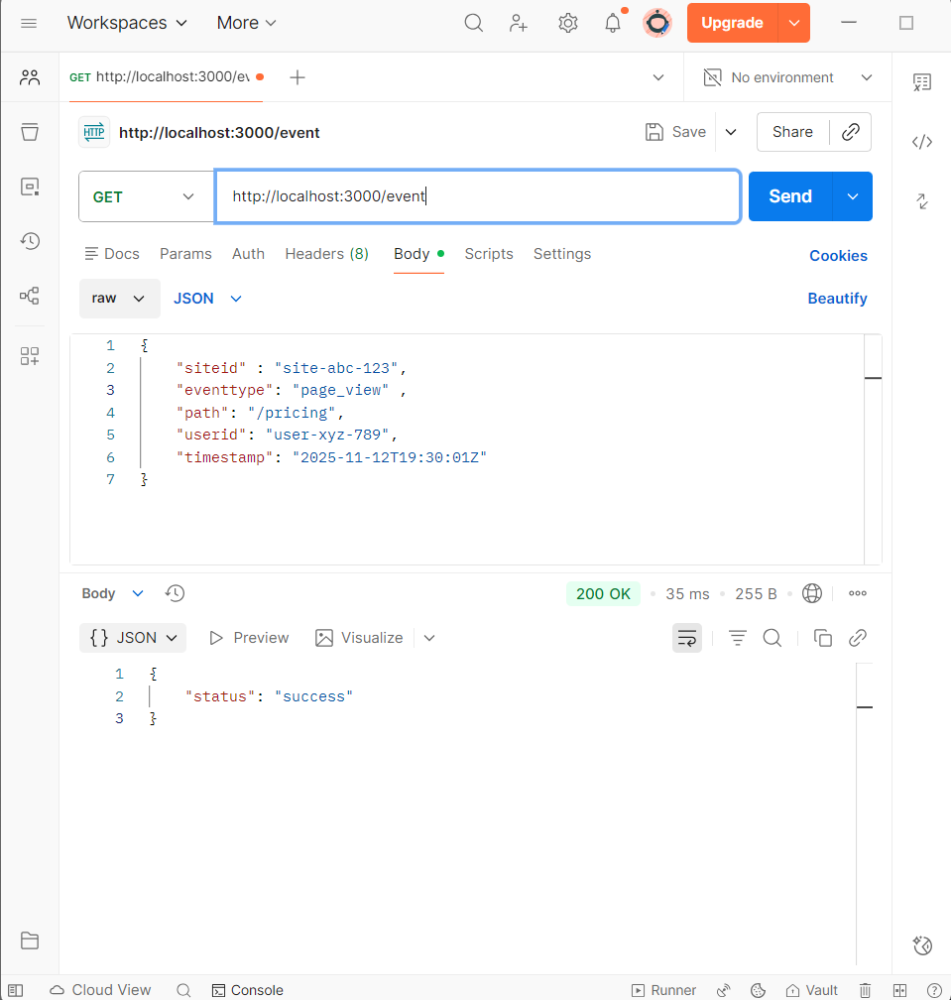
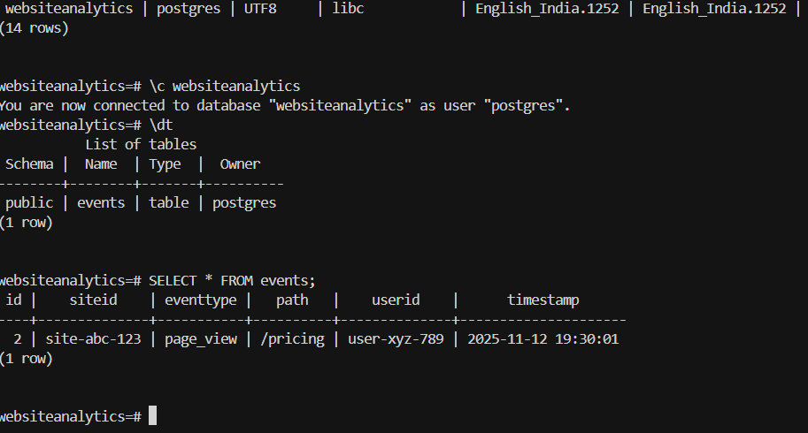

# WEBSITEANALYTICS
This project is a backend analytics system designed to quickly ingest website events, store them through an asynchronous queue, and provide a reporting API for analytics summaries.

# 🚀 Features
**Key Features:**
- **Extremely fast ingestion**: API never blocks on database writes.
- **Async processing**: Uses an in-memory queue; future-ready for Redis/RabbitMQ.
- **Stats API**: Fetch summarized views, unique users, and top paths per site.

## Architecture

- **/event** (`POST`): Ingestion API, validates JSON, instant response, enqueues.
- **In-memory Queue:** Fast local buffer (note: works only in single-process mode).
- **Processor Loop:** Runs in same process as server, dequeues events, saves to DB.
- **/stats** (`GET`): Summary statistics API.

# 🗂 Project Structure

website-analytics/
├── README.md
├── package.json
├── tsconfig.json
├── src/
│ ├── ingestion/index.ts
│ ├── queue/eventQueue.ts
│ ├── db/db.ts
│ ├── types/event.ts
│ ├── reporting/index.ts
│ └── db/schema.sql
├── Problem-Statement.pdf
├── screenshots/

# ⚡ Getting Started
### 1. Clone & Install

git clone https://github.com/PraneethPW/WEBSITEANALYTICS.git

cd WEBSITEANALYTICS

 ### 2. Setup PostgreSQL

 - Configure your DB credentials in `src/db/db.ts`.
 - 
### 3. Install Dependencies

npm install

### 4 . Build project

tsc -b

### 4. Run services

node dist/ingestion/index.js # Ingestion API + processor
node dist/reporting/index.js # Stats API

---

## API Usage

### POST /event

---

## 💡  Notes

- Only **one process** is used for queue and processing; for multi-process use Redis.
- Add error handling/logging for robustness in production.
- See `Problem-Statement.pdf` for the original assignment.

---

## Screenshots

- 
- 

Security: Reset credentials if environment secrets are ever leaked.

Customization: Fork/extend as needed for inventory, user auth, payments, etc.

# 📄 License
MIT — free for educational and personal use.

